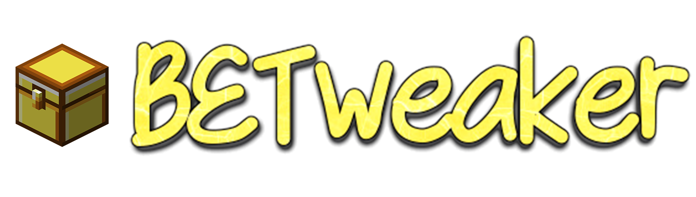

# BETweaker

##### [English](README.md) | 简体中文

`BETweaker`是一个添加游戏实用功能的插件，给生存玩家提供非常丰富而且实用的功能。 

功能包括但不限于：
- 右键快捷收割农作物

- 一人睡觉集体过夜
- 耕地防踩
- 生物、方块信息显示
- 生存飞行
- 编辑告示牌(需要BETweaker多功能木棍)
- 叶子快速腐烂
- 自动钓鱼
- 自动补齐物品
- 一键砍树
- 末地传送门刷重力方块
- 发射器破坏方块(需要BETweaker多功能木棍)
- 增加/seed命令来获取世界种子
- 下蹲右键经验修补工具
- 铁砧修复(铁锭右键修复，黑曜石右键破环)
- 发射器自动合成
- 雷击守卫者生成远古守卫者
- y小于0刷石机生成深层类石头

- 双门
- 

发射器种植农作物
    

    我们不想过多的干涉你的生电系统，所以我们精选了些合适发射器放置的方块

        覆盖范围的有：树苗, 作物， 蘑菇， 竹子
        如果你不喜欢或不需要此功能，你随时可以在配置文件中关掉此功能！
    

- BETweaker多功能木棍
  - 合成方法 

  - 功能
    - 下蹲,右键发射器改变是否破环方块
    - 下蹲，右键告示牌，触发编辑告示牌
    - ......

本插件所有功能性设置均可以在游戏内使用 **/bet** 来进行开关，或在游戏外 **"/plugins/BETweaker/config.json"** 目录下进行配置

除此之外，本插件**不会在不告知玩家的前提下修改原版游戏特性（如有修改游戏特性，将会标明），且所有功能均可选择性关闭**，而且理论上不会影响存档，你可以随时移除本插件而不对存档造成影响，因此本插件十分适合在生存服中使用。

### 💻下载

你可以到[Releases页面](https://github.com/dreamguxiang/BETweaker/releases) 来下载最新的版本。

### 🎯 安装和使用

本插件基于[LiteLoaderBDS](https://github.com/LiteLDev/LiteLoaderBDS)开发，LL提供的强大API系统，大大降低了开发成本与维护成本，因此加载BETweaker需要安装LiteLoaderBDS并丢入其生成的Plugins文件夹，才能正确加载运行。

### 🏆 致谢

- 感谢[hhhxiao](https://github.com/hhhxiao)提出的建议。
- 感谢[dofes](https://github.com/dofes)的帮助与贡献。
- 感谢[LiteLDev](https://github.com/LiteLDev)开发组成员的帮助与提议。

### 📞 联系

QQ群：883408219

### ⚠️ 警告

未经允许，禁止转载！擅自整合转载可能会使本插件停更！

#### 额外限制和例外

在没有授权允许的情况下，你不能将其分发、传播、整合！
